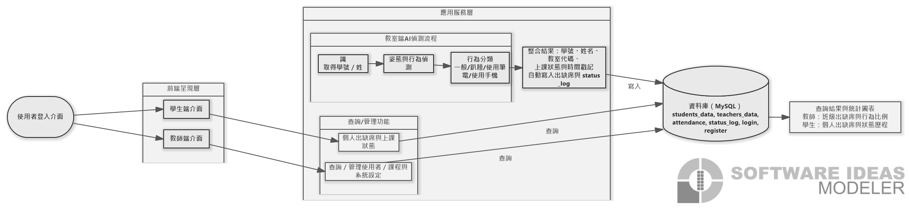
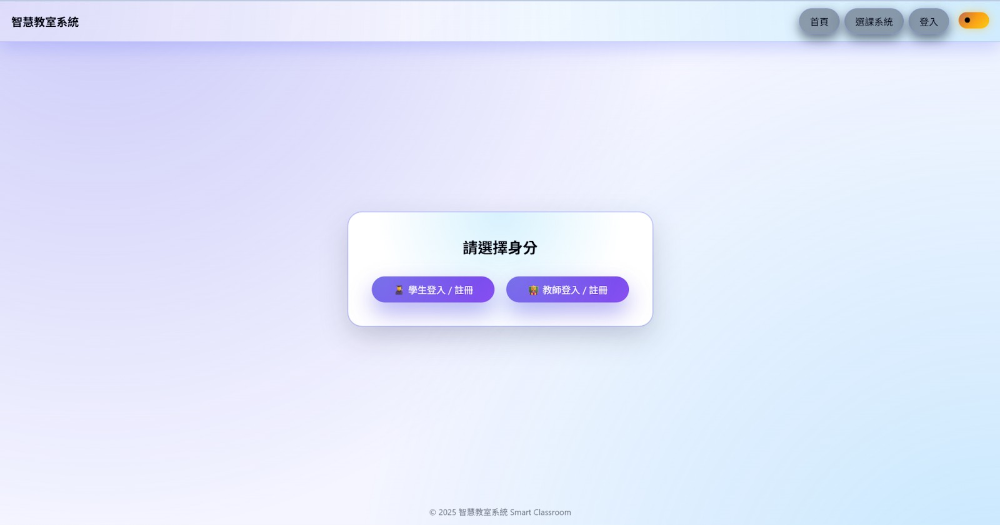
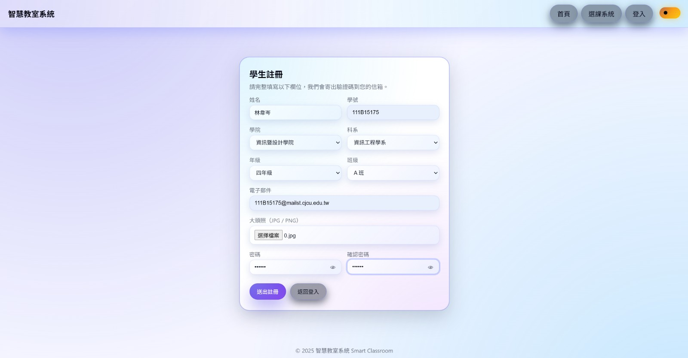
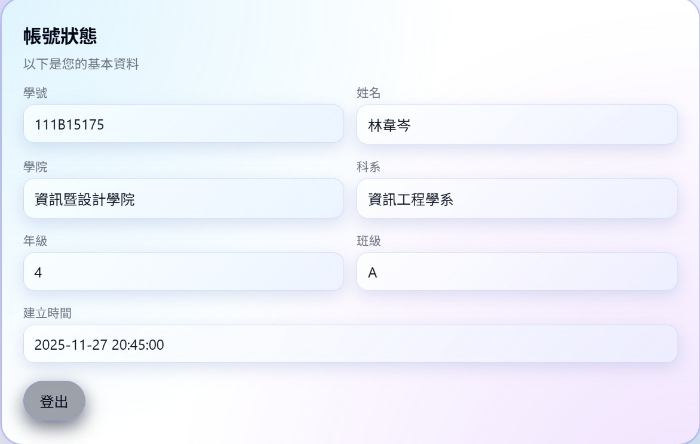
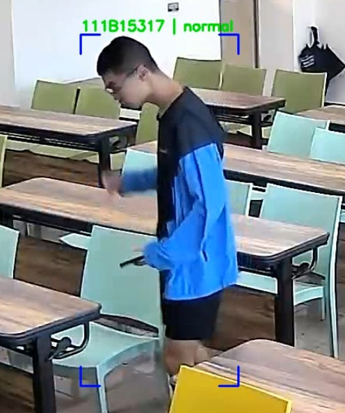
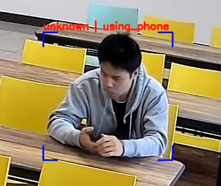

# smart-classroom-attendance-monitor
本專題旨在開發一套能在教室中自動完成學生出勤辨識與基本行為偵測的智慧系統。由影像擷取裝置取得畫面，使系統能同時辨識學生身分並判斷上課中的動作，如一般、趴睡、使用筆電、使用手機等狀態，並將資料寫入後端資料庫系統以供課堂管理與查詢。整體流程採用深度學習模型進行人臉辨識與動作分類，結合追蹤與資料整合機制，使其能在多人的教室環境中運作，有效降低老師點名的負擔並提升課堂管理效率。
## 主要功能
- 自動出勤辨識（已註冊/未註冊身分提示）
- 上課狀態監測（如：一般、趴睡、使用筆電、使用手機）
- Web 介面查詢（教師/學生不同視角）
- 辨識結果與狀態紀錄自動寫入後端資料庫

## 系統流程

## 介面展示
### 登入/身分選擇

### 學生註冊

### 學生狀態頁

### 選課系統（教師/學生）
.jpg)
.jpg)

## 辨識結果示例

## 說明
- 本展示 Repo 以「成果呈現」為主：流程圖、介面截圖與功能說明。
- 為保護隱私與安全，未公開包含個資、token/帳密、以及大型模型權重檔（如 .pt/.pth）。
- 如需完整可執行版本或示範影片，可於書審資料中的「其他補充」頁面提供連結或聯絡方式。
